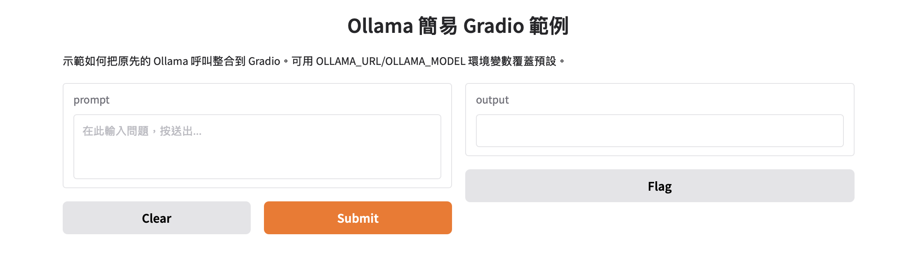

# Chat Models — 範例與說明

展示如何使用 LangChain 與不同廠商的 chat 模型（OpenAI、Google Gemini、Anthropic、Ollama 等）、建立對話歷史與將訊息儲存到 Firebase/Firestore。下方依檔名前綴數字分組（1 → 5）說明每個檔案內容。

## 目錄
1. [主要模型提供商的配置](#1_主要模型提供商的配置)
2. [連結各家模型基本範例](#2_連結各家模型基本範例)
3. [帶有 message objects 的對話範例](#2帶有message-objects的對話範例)
4. 替代/比較範例
5. 與使用者互動的對話範例（含 chat loop）
6. 儲存訊息歷史到 Firebase/Firestore


---

## 1_主要模型提供商的配置

**套件安裝**

```bash
langchain-google-genai
langchain-openai
langchain-anthropic
langchain-ollama
```

> 主要模型商申請API網址
> 1. 試用-[Google AI Studio](./https://aistudio.google.com/)
> 2. 需付費-[OpenAI Platform](https://platform.openai.com/docs/overview)->點選右上角設定後,選取左邊欄位APIkey
> 3. 需付費-[Anthropic console](https://console.anthropic.com/dashboard)->點選左邊的API keys
		
**env**

```bash
GOOGLE_API_KEY=XXXXXXXXX
OPENAI_API_KEY=XXXXXXX
ANTHROPIC_API_KEY=XXXXX
```

---

## 2_連結各家模型基本範例
- [1chat_model_basic.ipynb](./1chat_model_basic.ipynb)

用途：示範如何使用多家提供者的 chat model（OpenAI / Anthropic / Google / ollama）來呼叫並取得回應。

重點：
- 以 `langchain_openai.ChatOpenAI`、`ChatAnthropic`、`ChatGoogleGenerativeAI` 等建立模型。
- 範例使用 `SystemMessage` 與 `HumanMessage` 的 messages 列表作為輸入。
- 示範單次呼叫與在 messages 中包含先前 AI 回應再續問的情境。

依賴：`python-dotenv`、`langchain_openai`、`langchain_anthropic`、`langchain_google_genai`、`langchain_core`。

執行要點：載入 `.env` 後，用適當的環境變數（API key / project config）呼叫 `model.invoke(messages)`。

### google

- [1chat_model_basic.ipynb](./1chat_model_basic.ipynb)

```python
#google
# Chat Model Documents:https://python.langchain.com/docs/integrations/chat/
# Google Chat Model Documents: https://python.langchain.com/docs/integrations/chat/google_generative_ai/

from dotenv import load_dotenv
from langchain_google_genai import ChatGoogleGenerativeAI

# Load environment variables from .env
load_dotenv()

# Create a ChatGoogleGenerativeAI model
model = ChatGoogleGenerativeAI(model="gemini-2.5-flash")

# Invoke the model with a message
result = model.invoke("81除以9的答案是?")
print("所有答案")
print(result)
print("回答內容是")
print(result.content)
```

### openAI

- [1chat_model_basic.ipynb](./1chat_model_basic.ipynb)

```python
#openapi
# Chat Model Documents:https://python.langchain.com/docs/integrations/chat/
# Google Chat Model Documents:https://python.langchain.com/docs/integrations/chat/openai/ 

from dotenv import load_dotenv
from langchain_openai import ChatOpenAI

# Load environment variables from .env
load_dotenv()

# Create a ChatOpenAI model
model = ChatOpenAI(model="gpt-5-mini")

# Invoke the model with a message
result = model.invoke("81除以9的答案是?")
print("所有答案")
print(result)
print("回答內容是")
print(result.content)
```

### anthropic api

- [1chat_model_basic.ipynb](./1chat_model_basic.ipynb)

```python
#anthropic api
# Chat Model Documents:https://python.langchain.com/docs/integrations/chat/
# Google Chat Model Documents:https://python.langchain.com/docs/integrations/chat/anthropic/ 

from dotenv import load_dotenv
from langchain_anthropic import ChatAnthropic

# Load environment variables from .env
load_dotenv()

# Create a ChatAnthropic model
model = ChatAnthropic(model="claude-3-5-sonnet-latest")


# Invoke the model with a message
result = model.invoke("81除以9的答案是?")
print("所有答案")
print(result)
print("回答內容是")
print(result.content)
```

### ollama

- [1chat_model_basic.ipynb](./1chat_model_basic.ipynb)

```python
#ollama api
# Chat Model Documents:https://python.langchain.com/docs/integrations/chat/
# Google Chat Model Documents:https://python.langchain.com/docs/integrations/chat/ollama/


from langchain_ollama import ChatOllama


# Create a ChatOllama model
# 透過網址的方式連結ollama (指定 base_url 指向 Ollama server)
# 預設 Ollama server 在本機的 11434 埠，若在其他主機或埠請改成相對應的網址

model = ChatOllama(model="llama3.2:latest", base_url="http://host.docker.internal:11434")


# Invoke the model with a message
result = model.invoke("81除以9的答案是?")
print("所有答案")
print(result)
print("回答內容是")
print(result.content)
```

### olloma整合gradio

- [1ollama_gradio.py](./1ollama_gradio.py)

```python
from langchain_ollama import ChatOllama
import gradio as gr
from dotenv import load_dotenv
import os

# 載入環境變數（可用 OLLAMA_URL / OLLAMA_MODEL 覆蓋預設）
load_dotenv()
OLLAMA_URL = os.getenv("OLLAMA_URL", "http://host.docker.internal:11434")
MODEL_NAME = os.getenv("OLLAMA_MODEL", "llama3.2:latest")

# 使用最原始的呼叫方式：直接以字串 prompt 送到 Ollama
model = ChatOllama(model=MODEL_NAME, base_url=OLLAMA_URL)


def answer(prompt: str) -> str:
    """最簡單的 wrapper：把 prompt 傳給 model.invoke，回傳文字回應。"""
    if not prompt:
        return ""
    res = model.invoke(prompt)
    return res.content if hasattr(res, "content") else str(res)


# 最小的 Gradio 介面：一個輸入框 + 一個文字輸出
iface = gr.Interface(
    fn=answer,
    inputs=gr.Textbox(lines=3, placeholder="在此輸入問題，按送出..."),
    outputs="text",
    title="Ollama 簡易 Gradio 範例",
    description="示範如何把原先的 Ollama 呼叫整合到 Gradio。可用 OLLAMA_URL/OLLAMA_MODEL 環境變數覆蓋預設。",
)

if __name__ == "__main__":
    iface.launch(server_name="0.0.0.0", server_port=7860)
```


---

## 2帶有message objects的對話範例

### 2_chat_model_basic_conversation.py
用途：展示如何使用 `langchain_openai.ChatOpenAI`（或其他 provider）搭配 `langchain_core.messages` 中的 `SystemMessage` / `HumanMessage` / `AIMessage` 來構造 messages 列表並呼叫模型。

重點：
- 以 messages 陣列表示完整對話上下文。
- 範例包含系統提示與多輪對話（human、ai、human），示範模型利用上下文回答後續問題。

依賴：`python-dotenv`、`langchain_openai`、`langchain_core`。

執行要點：示範多家 provider 的呼叫方式（OpenAI / Google / Anthropic 範例皆有）。

---

### 2_chat_model_basic_conversation_google.py
用途：類似 `2_chat_model_basic_conversation.py`，但示範使用 Google 的 `ChatGoogleGenerativeAI` 來以 messages 陣列提供上下文並取得回覆。

重點與執行：同上，需額外注意 Google 模型名稱與授權設定。

---

### 2_chat_model_basic_conversation_ollama.py
用途：同樣是 messages-based 的示範，但用 `OllamaLLM` 來示範多輪對話的傳遞方式。

重點：Ollama 的 `invoke` 可接受 messages 陣列（或 prompt），回傳可直接印出或放入後續 context。

---

## 3 — 替代/比較範例

### 3_chat_model_alternatives.py
用途：比較不同提供者的結果或示範如何在程式中替換模型（OpenAI、Google、Ollama 等）。

重點：
- 同一套 messages 或 prompt 同時呼叫多個 model，並印出各自回應以便比較。

依賴：視使用的 provider 而定（在檔案中可看到 `ChatGoogleGenerativeAI`、`OllamaLLM` 等）。

---

### 3_chat_model_alternatives1.py
用途：進一步的替代/比較範例，範例中呼叫 Google 與 Ollama，並示範把相同 messages 送給不同模型。

重點：用於教學比較各模型在相同 prompt 下的差異。

---

## 4 — 與使用者互動的對話範例

### 4_chat_model_conversation_with_user.py
用途：示範一個簡單的 chat loop（互動式），持續保存 `chat_history`（list），並將其作為上下文傳給模型取得回覆。

重點：
- 使用 `SystemMessage` 作為初始提示（例如：You are a helpful AI assistant.）。
- 以 while 迴圈讀取使用者輸入，送出 `chat_history` 呼叫 `model.invoke(chat_history)`，再把回覆加入 history。
- 範例包含停止條件（輸入 `exit` 結束）。

依賴：`python-dotenv`、相應 provider 的 LangChain wrapper（OpenAI / Google / Ollama）。

執行要點：適合做本地互動測試或教學示範。

---

### 4_chat_model_conversation_with_user_google.py
用途：同 `4_chat_model_conversation_with_user.py`，但示範使用 `ChatGoogleGenerativeAI` 作為後端。

重點與執行：確保 Google 授權與 model 名稱正確。

---

### 4_chat_model_conversation_with_user_ollama.py
用途：同上，但使用 Ollama LLM 作為互動式對話後端。

重點：Ollama 回傳格式可能與其他 provider 不同，範例展示如何把回應加入 `chat_history`。

---

## 5 — 儲存訊息歷史到 Firebase/Firestore

### 5_chat_model_save_message_history_firebase.py
用途：示範如何把對話歷史儲存到 Google Firestore（Firebase），使用 `langchain_google_firestore.FirestoreChatMessageHistory`。

重點：
- 範例展示 Firestore client 初始化、建立 `FirestoreChatMessageHistory(session_id, collection, client)`，並示範如何 `add_user_message` / `add_ai_message`。
- 範例中包含步驟說明（建立 Firebase 專案、啟用 Firestore、設定 Google Cloud CLI 與認證等）。

依賴：`python-dotenv`、`google-cloud-firestore`、`langchain_google_firestore`、`langchain_openai`（或其他 chat provider）。

執行要點：請先在 Google Cloud Console 設定好專案與認證，並在本機設定 ADC 或 service account，否則無法初始化 `firestore.Client`。

---

## 常見注意事項與執行前準備

- 請先安裝專案根目錄的 `requirements.txt` 中相依套件，或依每個範例自行安裝需要的 provider wrapper（例如 `langchain_google_genai`、`langchain_ollama`、`langchain_anthropic` 等）。
- 多數範例使用 `python-dotenv`（`load_dotenv()`），請建立 `.env` 並放入 API keys、Google credentials path 等必要環境變數。
- Google/Firestore 範例需額外設定 GCP 認證（ADC 或 service account JSON）。
- Ollama 範例需在可用的 Ollama 環境中執行並確保 model 已載入。

## 完成情況

- 依據資料夾內的所有 `*.py` 檔案，已在本檔案中依數字前綴（1→5）逐一說明。若要我把每個範例的重點程式片段整理成單獨小節或加入執行指令範例（含 .env 範本），我可以接著新增。
