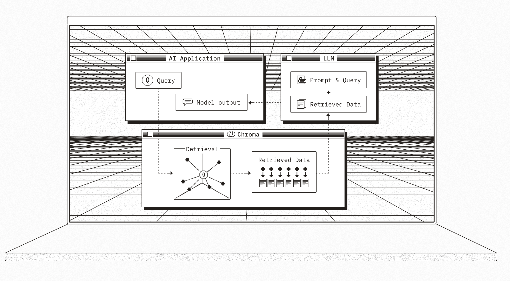

# Chroma向量資料庫
- 開源的免費資料庫
- 專門給LLM使用的資料庫
- 可儲存在記憶體,本機,也可以在雲端

## 工作原理



## 初始設定

**1:安裝**

```python
pip install chromadb
```

**2:建立Chroma Client**

```python
import chromadb
chroma_client = chromadb.Client()
```

**3建立Collection**

```python
collection = chroma_client.create_collection(name="my_collection")
```

**4增加document至collection**

```python
collection.add(
    documents=[
        "This is a document about pineapple",
        "This is a document about oranges"
    ],
    ids=["id1", "id2"]
)
```


**collection的查詢**

```python
from pprint import pprint
result = collection.query(
    query_texts=["This is a query document ablut hawaii"],
    n_results=2
)
pprint(result)

#==output==
- distance代表語義相似的距離
- 以下相似於pineapple(距離較短)

{'data': None,
 'distances': [[1.04865562915802, 1.2358505725860596]],
 'documents': [['This is a document about pineapple',
                'This is a document about oranges']],
 'embeddings': None,
 'ids': [['id1', 'id2']],
 'included': [<IncludeEnum.distances: 'distances'>,
              <IncludeEnum.documents: 'documents'>,
              <IncludeEnum.metadatas: 'metadatas'>],
 'metadatas': [[None, None]],
 'uris': None}
```

**再一次**

```python
import chromadb
from pprint import pprint
chroma_client = chromadb.Client()

#使用get_or_create_collection方法建立資料庫, 如果已經存在則直接取得
collection = chroma_client.get_or_create_collection(name="my_collection")

#使用upsert避免重複加入資料
collection.upsert(
    documents=[
        "This is a document about watermelon",
        "This is a document about apples"
    ],
    ids=["id1", "id2"]
)

result = collection.query(
    query_texts=["This is a query document about watermelon"],
    n_results=2
)
pprint(result)

#==output==
{'data': None,
 'distances': [[0.13670675456523895, 0.8721231818199158]],
 'documents': [['This is a document about watermelon',
                'This is a document about apples']],
 'embeddings': None,
 'ids': [['id1', 'id2']],
 'included': [<IncludeEnum.distances: 'distances'>,
              <IncludeEnum.documents: 'documents'>,
              <IncludeEnum.metadatas: 'metadatas'>],
 'metadatas': [[None, None]],
 'uris': None}
```

> 注意這裏使用的是暫時的client,chroma是建立在記憶體內,應用程式結束,所有資料將會被消滅。


