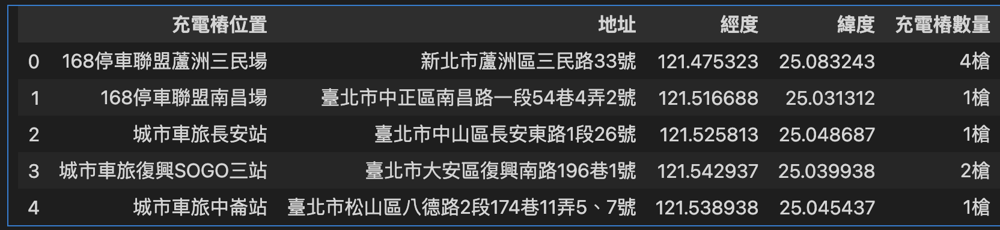

# 將csv資料加入至Chroma
- 001.csv

```csv
充電樁位置,地址,經度,緯度,充電樁數量
168停車聯盟蘆洲三民場,新北市蘆洲區三民路33號,121.4753234,25.0832431,4槍
168停車聯盟南昌場,臺北市中正區南昌路一段54巷4弄2號,121.5166875,25.0313125,1槍
城市車旅長安站,臺北市中山區長安東路1段26號,121.5258125,25.0486875,1槍
城市車旅復興SOGO三站,臺北市大安區復興南路196巷1號,121.5429375,25.0399375,2槍
城市車旅中崙站,臺北市松山區八德路2段174巷11弄5、7號,121.5389375,25.0454375,1槍
城市車旅青年站,臺北市萬華區水源路213巷內,121.5013125,25.0193125,6槍
城市車旅延吉站,臺北市松山區八德路3段106巷13號旁,121.5538125,25.0475625,1槍
城市車旅古亭站,臺北市大安區和平東路1段53號,121.5240625,25.0271875,1槍
城市車旅士東國小站,台北市士林區中山北路6段424號,121.5271875,25.1136875,1槍
城市車旅瑞安站,臺北市大安區和平東路二段89號,121.5393125,25.0256875,2槍
城市車旅台北科技站,臺北市大安區復興南路二段193巷16號,121.544465,25.0263957,1槍
城市車旅永康二站,臺北市大安區永康街13巷8號,121.5301875,25.0325625,1槍
城市車旅忠孝玉成站,臺北市南港區忠孝東路六段62號,121.5835625,25.0459375,2槍
```


```python
import pandas as pd

# 讀取 csv 檔案
csv_path = '001.csv'
df = pd.read_csv(csv_path)
df.head()

```



```python
import chromadb
import chromadb.utils.embedding_functions as embedding_functions
import os
from dotenv import load_dotenv

load_dotenv()
# 設定 Hugging Face 嵌入函數（需要 API Key）
# exprot HUGGINGFACE_API_KEY=api_xxx

huggingface_ef = embedding_functions.HuggingFaceEmbeddingFunction(
    api_key=os.getenv('HUGGINGFACE_API_KEY'),
    model_name = 'intfloat/multilingual-e5-large'
)

# 初始化 ChromaDB
client = chromadb.PersistentClient(path="./chroma_db")
charging_station = client.get_or_create_collection(
    name='charging_station',
    embedding_function=huggingface_ef
    )

```

```python
#加入資料
for index, row in df.iterrows():
    station_info = f'{row["充電樁位置"]}, 地址:{row["地址"]},充電樁數量:{row["充電樁數量"]}'
    metadata = {
        "longitude": float(row["經度"]),
        "latitude": float(row['緯度']),
    }
    
    #插入資料
    charging_station.upsert(
        ids = [str(index)],
        documents=[station_info],
        metadatas = [metadata]
    )

print("充電椿資料已存入ChromaDB")

#==output==
充電椿資料已存入ChromaDB
```

```python
#查詢
charging_station.peek()
charging_station.count()

#==output==
#查詢
charging_station.peek()
charging_station.count()

#==output==
13
```

```python
all_stations = charging_station.get() #取得所有資料
all_stations

#==output==
{'ids': ['0', '1', '2', '3', '4', '5', '6', '7', '8', '9', '10', '11', '12'],
 'embeddings': None,
 'documents': ['168停車聯盟蘆洲三民場, 地址:新北市蘆洲區三民路33號,充電樁數量:4槍',
  '168停車聯盟南昌場, 地址:臺北市中正區南昌路一段54巷4弄2號,充電樁數量:1槍',
  '城市車旅長安站, 地址:臺北市中山區長安東路1段26號,充電樁數量:1槍',
  '城市車旅復興SOGO三站, 地址:臺北市大安區復興南路196巷1號,充電樁數量:2槍',
  '城市車旅中崙站, 地址:臺北市松山區八德路2段174巷11弄5、7號,充電樁數量:1槍',
  '城市車旅青年站, 地址:臺北市萬華區水源路213巷內,充電樁數量:6槍',
  '城市車旅延吉站, 地址:臺北市松山區八德路3段106巷13號旁,充電樁數量:1槍',
  '城市車旅古亭站, 地址:臺北市大安區和平東路1段53號,充電樁數量:1槍',
  '城市車旅士東國小站, 地址:台北市士林區中山北路6段424號,充電樁數量:1槍',
  '城市車旅瑞安站, 地址:臺北市大安區和平東路二段89號,充電樁數量:2槍',
  '城市車旅台北科技站, 地址:臺北市大安區復興南路二段193巷16號,充電樁數量:1槍',
  '城市車旅永康二站, 地址:臺北市大安區永康街13巷8號,充電樁數量:1槍',
  '城市車旅忠孝玉成站, 地址:臺北市南港區忠孝東路六段62號,充電樁數量:2槍'],
 'uris': None,
 'data': None,
 'metadatas': [{'latitude': 25.0832431, 'longitude': 121.4753234},
  {'latitude': 25.0313125, 'longitude': 121.5166875},
  {'latitude': 25.0486875, 'longitude': 121.5258125},
  {'latitude': 25.0399375, 'longitude': 121.5429375},
  {'latitude': 25.0454375, 'longitude': 121.5389375},
  {'latitude': 25.0193125, 'longitude': 121.5013125},
  {'latitude': 25.0475625, 'longitude': 121.5538125},
  {'latitude': 25.0271875, 'longitude': 121.5240625},
  {'latitude': 25.1136875, 'longitude': 121.5271875},
  {'latitude': 25.0256875, 'longitude': 121.5393125},
  {'latitude': 25.0263957, 'longitude': 121.544465},
  {'latitude': 25.0325625, 'longitude': 121.5301875},
  {'latitude': 25.0459375, 'longitude': 121.5835625}],
 'included': [<IncludeEnum.documents: 'documents'>,
  <IncludeEnum.metadatas: 'metadatas'>]}
```


```python
from geopy.distance import geodesic
from pprint import pprint
# 用戶的目前位置('台北車站')
user_location = (25.0478, 121.5171)

#計算和用戶的距離
stations_with_distance = []
for doc, meta in zip(all_stations["documents"], all_stations["metadatas"]):    
    stations_location = (meta["latitude"], meta['longitude']) #取出座標
    distance_km = geodesic(user_location, stations_location).km #計算距離
    stations_with_distance.append((doc, distance_km))
pprint(stations_with_distance)

#==output==
[('168停車聯盟蘆洲三民場, 地址:新北市蘆洲區三民路33號,充電樁數量:4槍', 5.760379671072387),
 ('168停車聯盟南昌場, 地址:臺北市中正區南昌路一段54巷4弄2號,充電樁數量:1槍', 1.8268520340991024),
 ('城市車旅長安站, 地址:臺北市中山區長安東路1段26號,充電樁數量:1槍', 0.8846635093599351),
 ('城市車旅復興SOGO三站, 地址:臺北市大安區復興南路196巷1號,充電樁數量:2槍', 2.7489907110443865),
 ('城市車旅中崙站, 地址:臺北市松山區八德路2段174巷11弄5、7號,充電樁數量:1槍', 2.219150272757932),
 ('城市車旅青年站, 地址:臺北市萬華區水源路213巷內,充電樁數量:6槍', 3.535085172551711),
 ('城市車旅延吉站, 地址:臺北市松山區八德路3段106巷13號旁,充電樁數量:1槍', 3.7047920325954378),
 ('城市車旅古亭站, 地址:臺北市大安區和平東路1段53號,充電樁數量:1槍', 2.3889869393129213),
 ('城市車旅士東國小站, 地址:台北市士林區中山北路6段424號,充電樁數量:1槍', 7.369234386035939),
 ('城市車旅瑞安站, 地址:臺北市大安區和平東路二段89號,充電樁數量:2槍', 3.3204064126342745),
 ('城市車旅台北科技站, 地址:臺北市大安區復興南路二段193巷16號,充電樁數量:1槍', 3.639861233396292),
 ('城市車旅永康二站, 地址:臺北市大安區永康街13巷8號,充電樁數量:1槍', 2.1432301277357624),
 ('城市車旅忠孝玉成站, 地址:臺北市南港區忠孝東路六段62號,充電樁數量:2槍', 6.7100204727346675)]
```

```python
#根據距離排序
stations_with_distance.sort(key=lambda x:x[1])
stations_with_distance

#==output==
[('城市車旅長安站, 地址:臺北市中山區長安東路1段26號,充電樁數量:1槍', 0.8846635093599351),
 ('168停車聯盟南昌場, 地址:臺北市中正區南昌路一段54巷4弄2號,充電樁數量:1槍', 1.8268520340991024),
 ('城市車旅永康二站, 地址:臺北市大安區永康街13巷8號,充電樁數量:1槍', 2.1432301277357624),
 ('城市車旅中崙站, 地址:臺北市松山區八德路2段174巷11弄5、7號,充電樁數量:1槍', 2.219150272757932),
 ('城市車旅古亭站, 地址:臺北市大安區和平東路1段53號,充電樁數量:1槍', 2.3889869393129213),
 ('城市車旅復興SOGO三站, 地址:臺北市大安區復興南路196巷1號,充電樁數量:2槍', 2.7489907110443865),
 ('城市車旅瑞安站, 地址:臺北市大安區和平東路二段89號,充電樁數量:2槍', 3.3204064126342745),
 ('城市車旅青年站, 地址:臺北市萬華區水源路213巷內,充電樁數量:6槍', 3.535085172551711),
 ('城市車旅台北科技站, 地址:臺北市大安區復興南路二段193巷16號,充電樁數量:1槍', 3.639861233396292),
 ('城市車旅延吉站, 地址:臺北市松山區八德路3段106巷13號旁,充電樁數量:1槍', 3.7047920325954378),
 ('168停車聯盟蘆洲三民場, 地址:新北市蘆洲區三民路33號,充電樁數量:4槍', 5.760379671072387),
 ('城市車旅忠孝玉成站, 地址:臺北市南港區忠孝東路六段62號,充電樁數量:2槍', 6.7100204727346675),
 ('城市車旅士東國小站, 地址:台北市士林區中山北路6段424號,充電樁數量:1槍', 7.369234386035939)]
```

```python
#顯示最近的3個充電站
print("最近的充電站:")
for station, distance in stations_with_distance[:3]:
    print(f"{station}, 距離:{distance:.2f} 公里")
    
#==output==
最近的充電站:
城市車旅長安站, 地址:臺北市中山區長安東路1段26號,充電樁數量:1槍, 距離:0.88 公里
168停車聯盟南昌場, 地址:臺北市中正區南昌路一段54巷4弄2號,充電樁數量:1槍, 距離:1.83 公里
城市車旅永康二站, 地址:臺北市大安區永康街13巷8號,充電樁數量:1槍, 距離:2.14 公里
```

**自然語言搜尋**

```python
query_text = "永康二站在什麼地方?"
result = charging_station.query(
    query_texts = [query_text],
    n_results=3
)
result['documents'][0][0]

#==output==
'城市車旅永康二站, 地址:臺北市大安區永康街13巷8號,充電樁數量:1槍'
```

```python
client.delete_collection(name='charging_station')
```


