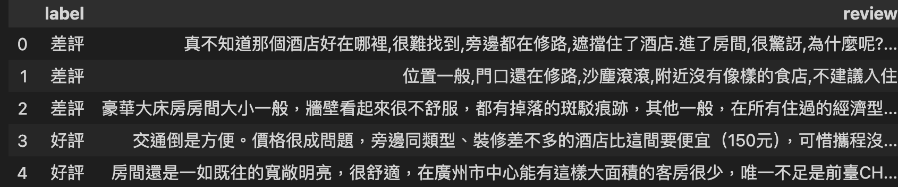

# 酒店資料(大約8000筆數的資料輸入)
- 使用ChnSentiCorp_htl_all.csv

```python
import pandas as pd

df = pd.read_csv('ChnSentiCorp_htl_all.csv')
df.info()

#==output==
<class 'pandas.core.frame.DataFrame'>
RangeIndex: 7766 entries, 0 to 7765
Data columns (total 2 columns):
 #   Column  Non-Null Count  Dtype 
---  ------  --------------  ----- 
 0   label   7766 non-null   int64 
 1   review  7765 non-null   object
dtypes: int64(1), object(1)
memory usage: 121.5+ KB
```


```python
df = df.dropna()
df.info()

#==output==
<class 'pandas.core.frame.DataFrame'>
Index: 7765 entries, 0 to 7765
Data columns (total 2 columns):
 #   Column  Non-Null Count  Dtype 
---  ------  --------------  ----- 
 0   label   7765 non-null   int64 
 1   review  7765 non-null   object
dtypes: int64(1), object(1)
memory usage: 182.0+ KB
```

```python
#重新隨機排序DataFrame
df_shuffled = df.sample(frac=1, random_state=42).reset_index(drop=True)
df_shuffled.head()

#==output==
#重新隨機排序DataFrame
df_shuffled = df.sample(frac=1, random_state=42).reset_index(drop=True)
df_shuffled.head()
```


```python
#label欄位,0為差評,1為好評

df_shuffled['label'] = df_shuffled['label'].apply(lambda value: '好評' if value == 1 else '差評')
df_shuffled.head()
```



```python
len(df_shuffled)

#==output==
7765
```


```python
#初始化chroma db
import chromadb
import chromadb.utils.embedding_functions as embedding_functions
import os
from dotenv import load_dotenv

load_dotenv()
#多筆資料和中文,最好直接使用huggingface提供的sentence embedding

# 初始化 ChromaDB
client = chromadb.PersistentClient(path="./chroma_db")
hotel_info = client.get_or_create_collection(
    name='hotel_info',
)
```

```python
from sentence_transformers import SentenceTransformer
model = SentenceTransformer("intfloat/multilingual-e5-large")

for index, row in df_shuffled.iterrows():
    ids = []
    documents = []
    metadatas = []
    embeddings = []

    embedding = model.encode(row['review']).tolist()
    embeddings.append(embedding)

    ids.append(str(index))   
    documents.append(row['review'])
    metadatas.append({
        'message':row['label']
    })
    

    #插入資料
    hotel_info.add(
        ids = ids,
        documents = documents,
        embeddings=embeddings,
        metadatas = metadatas
    )
    
print("資料已經存入")
```

```python
hotel_info.peek()

#==output==
{'ids': ['0', '1', '2', '3', '4', '5', '6', '7', '8', '9'],
 'embeddings': array([[ 0.01103258,  0.00367525, -0.03003611, ...,  0.00422477,
         -0.03485984,  0.00144743],
        [ 0.0155171 , -0.00142099, -0.03764709, ...,  0.00976248,
         -0.03516549, -0.00204681],
        [ 0.00965643,  0.01150021, -0.03120336, ..., -0.01861285,
         -0.0447603 ,  0.00586364],
        ...,
        [ 0.02929634,  0.00075534, -0.03207712, ..., -0.01269605,
         -0.03243466, -0.00344312],
        [ 0.0191416 , -0.00532915, -0.02515149, ...,  0.00562914,
         -0.03561803,  0.01563948],
        [ 0.05620942,  0.00733784, -0.0323485 , ...,  0.00674176,
         -0.05438549,  0.01916638]], shape=(10, 1024)),
 'documents': ['真不知道那個酒店好在哪裡,很難找到,旁邊都在修路,遮擋住了酒店.進了房間,很驚訝,為什麼呢?房間不是一般的小,佈置也不是一般的奇怪,床竟然就在門的邊上.進了洗手間,更驚訝,是住過的酒店裡最小最小的衛生間了.比香港的酒店衛生間都小,洗澡很不爽,因為水也非常小.從視窗看出去,什麼風景都沒有.早上點了客房送餐,量極小,也不好吃.出門叫計程車更暈了,堂堂一個五星級酒店竟然等了二十多分鐘才等到計程車,上了車以後,旁邊一條路都在修,結果去機場飛機都沒趕上,太鬱悶了.以後不會去住這家破酒店了,怪不得住的人那麼少!',
  '位置一般,門口還在修路,沙塵滾滾,附近沒有像樣的食店,不建議入住',
  '豪華大床房房間大小一般，牆壁看起來很不舒服，都有掉落的斑駁痕跡，其他一般，在所有住過的經濟型酒店裡算差，比火車站那家168要差。另外對酒店的服務水準非常有質疑，當天入住時，身份證給予登記後竟然沒有還給我，而且當時前臺就發現了，可以她一沒有主動送還到我房間，二連電話通知我一下都沒有，順手夾在了他們的工作板裡，想當然的認為第二天的前臺在我退房時會將其交換，可是第二天退房時並沒有退還，直到當天下午我在廬山的賓館要登記時，才發現身份證遍尋不著，心裡琢磨只有可能遺忘在了該酒店，電話過去前臺找了半天，終於發現。由於這個工作失誤，導致我的行程被打亂，最後不得不取消了廬山機場起飛的航班，再次回到南昌去取身份證，在要求報銷到酒店的打車費15元時，還非常的不爽氣，當時大堂經理詢問總經理後給我的回覆是：這種事情是酒店經常會發生的，我們酒店是從來沒有規定為旅客報銷車費的，如果要報銷只有讓前臺自己賠償你們15元。我認為說這種話是很不職業的，我作為住客面對的是你們酒店，是和你們酒店的交涉，而不是和你們的員工，賠償也是酒店方對住客的賠償，具體你們企業內部如何進行責任認定和教育那時你們內部的事，是不用和客人解釋的。最後在送我們出門時，他們的大堂經理還說了一句，我們這種商務性酒店出這種那種問題是很正常的，讓人聽了十分的不解和不舒服。有這種心態管理的酒店我表示遺憾。這是我第一次入住該集團的酒店，我相信也是最後一次。',
  '交通倒是方便。價格很成問題，旁邊同類型、裝修差不多的酒店比這間要便宜（150元），可惜攜程沒有簽約。房間算合格。',
  '房間還是一如既往的寬敞明亮，很舒適，在廣州市中心能有這樣大面積的客房很少，唯一不足是前臺CHECKIN慢！',
  '缺點是房間裡一點訊號都沒.這點很惱火,試問一下萬一家中有急事,卻聯絡不到本人怎麼辦?問題很嚴重,一往壞的地方想,以後就不會入住此店了.',
  '酒店挺不錯的,接機的車也大,酒店環境也好.離公園大門不遠,走走就到,路上還能拍照,很幸運遇上陳大叔給我們做導遊.早餐還行.價格略貴些',
  '酒店的地理位置非常棒,住的高階商務間.感覺房間非常小.門童和服務生都非常熱情.還有免費的水果.地毯和裝修有些陳舊~',
  '去年出差時就住過中州，當時帶客戶去的，感覺不錯。所以今年出差又選這家了。',
  '入住了海悅灣酒店，感覺很不錯，我們住的是豪華蜜月房，房間佈置的很溫馨、浪漫，讓我們很是開心和驚喜！房間很新很乾淨。這裡的服務挺好的，有什麼問題，服務人員都比較及時的趕來處理。早餐也挺豐富，還有13樓咖啡廳看海非常好！這裡的吃住價格我感覺還比較合理，酒店這麼貼心的服務讓我們感覺到物有所值！'],
 'uris': None,
 'data': None,
 'metadatas': [{'message': '差評'},
  {'message': '差評'},
  {'message': '差評'},
  {'message': '好評'},
  {'message': '好評'},
  {'message': '差評'},
  {'message': '好評'},
  {'message': '好評'},
  {'message': '好評'},
  {'message': '好評'}],
 'included': [<IncludeEnum.embeddings: 'embeddings'>,
  <IncludeEnum.documents: 'documents'>,
  <IncludeEnum.metadatas: 'metadatas'>]}
```


```python
query_text = '門童和服務生都非常熱情'
embedding = model.encode(query_text).tolist()
hotel_info.query(
    query_embeddings=[embedding],
    n_results=10,
    where_document={'$contains':"門童"} ##document內一定要有包含門童
)

#==output==
{'ids': [['6374',
   '5745',
   '4604',
   '4510',
   '478',
   '1478',
   '7',
   '753',
   '723',
   '72']],
 'embeddings': None,
 'documents': [['我的國外客人十分滿意，我本人對大堂和門童也是很滿意。',
   '房間設施很好，服務很周到．特別是門童和前臺，很熱情．酒店每晚都徵求意見，看有什麼不滿意的，這是其他酒店沒有的．',
   '第一感覺就是門童服務很到位，前臺服務也面帶微笑。房間比較寬敞明亮，上網速度也很快。很滿意的一家酒店！',
   '裝修較舊,特別是地毯的材質顏色顯得較髒,與四星的評級很不相稱,門童很熱情,贊一個',
   '房間、服務尚可，就是電視訊道太少，門童不是很積極的服務，可能天氣冷？',
   '門童好像不錯,其他不記得了晚上睡得還可以',
   '酒店的地理位置非常棒,住的高階商務間.感覺房間非常小.門童和服務生都非常熱情.還有免費的水果.地毯和裝修有些陳舊~',
   '房間設定不錯,感覺比較新.洗手間很寬敞明亮,美中不足是洗手間的地板,稍微沾上點水就容易滑倒.早餐不錯,品種比較多.服務員,門童都很熱情,總得來說比較滿意.',
   '房間很乾淨！早餐很豐盛！門童很好！已經是第二次訂那了。以後還會住。',
   '地段非常棒.住的是高階商務間.感覺房間有些小.另空調`的製冷效果也不行.不過門童和服務生很熱情.而且有免費水果.地毯和裝修有些陳舊~~~']],
 'uris': None,
 'data': None,
 'metadatas': [[{'message': '好評'},
   {'message': '好評'},
   {'message': '好評'},
   {'message': '好評'},
   {'message': '好評'},
   {'message': '好評'},
   {'message': '好評'},
   {'message': '好評'},
   {'message': '好評'},
   {'message': '好評'}]],
 'distances': [[0.20208819210529327,
   0.22433137893676758,
   0.24419090151786804,
   0.2591841518878937,
   0.26229554414749146,
   0.26587414741516113,
   0.27049097418785095,
   0.271889865398407,
   0.27306094765663147,
   0.2763976454734802]],
 'included': [<IncludeEnum.distances: 'distances'>,
  <IncludeEnum.documents: 'documents'>,
  <IncludeEnum.metadatas: 'metadatas'>]}
```


