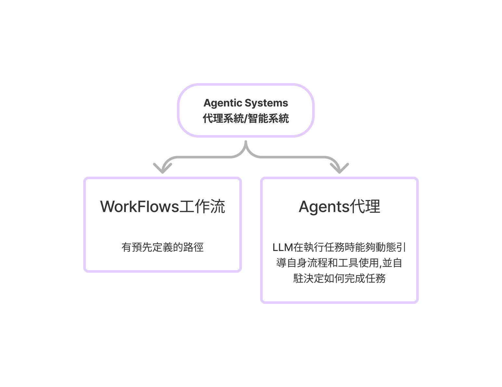
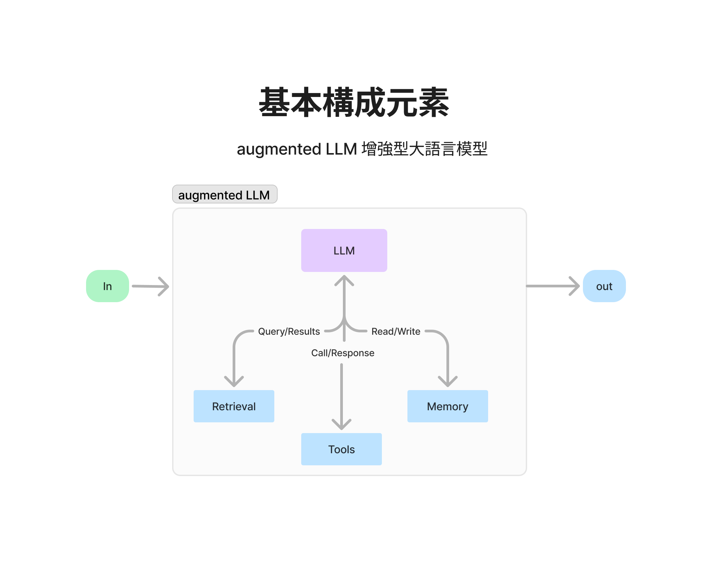
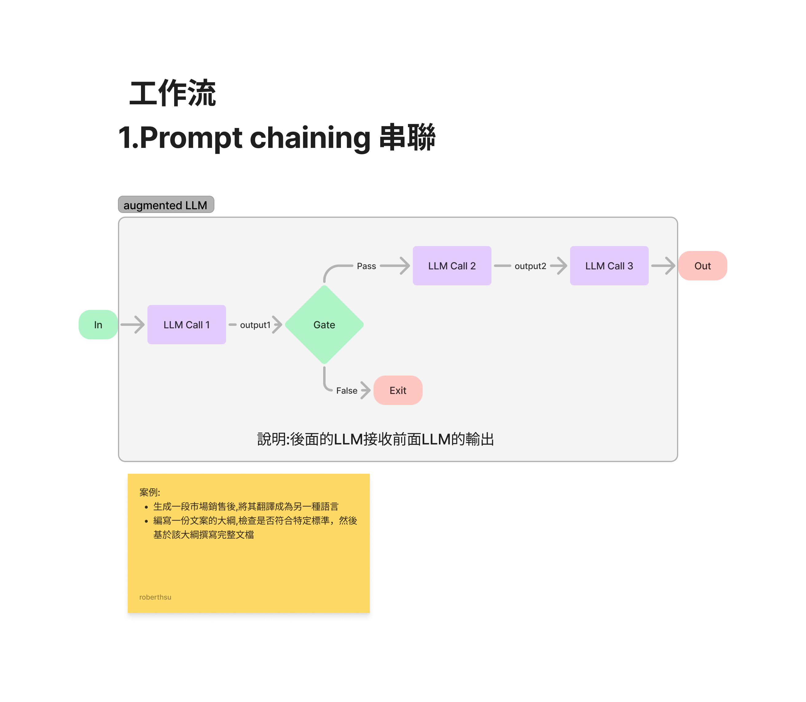
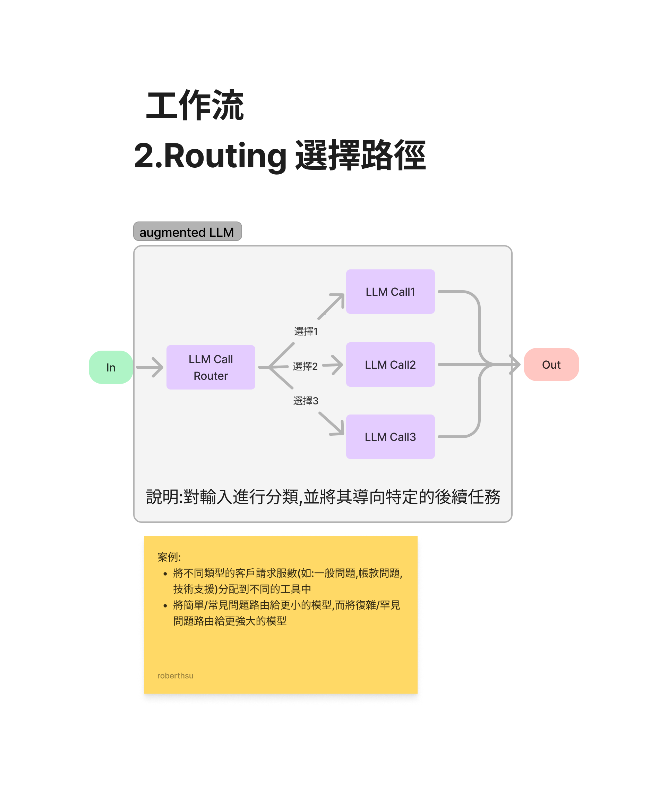
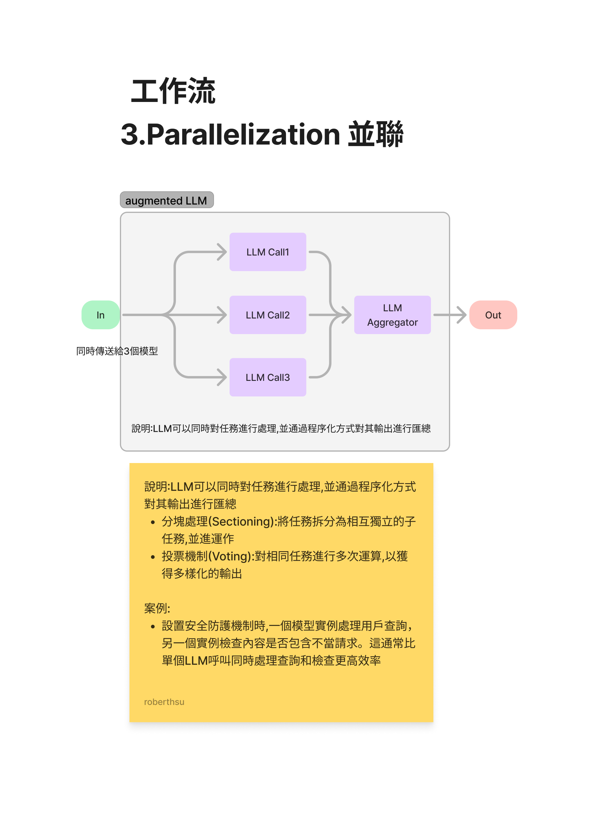
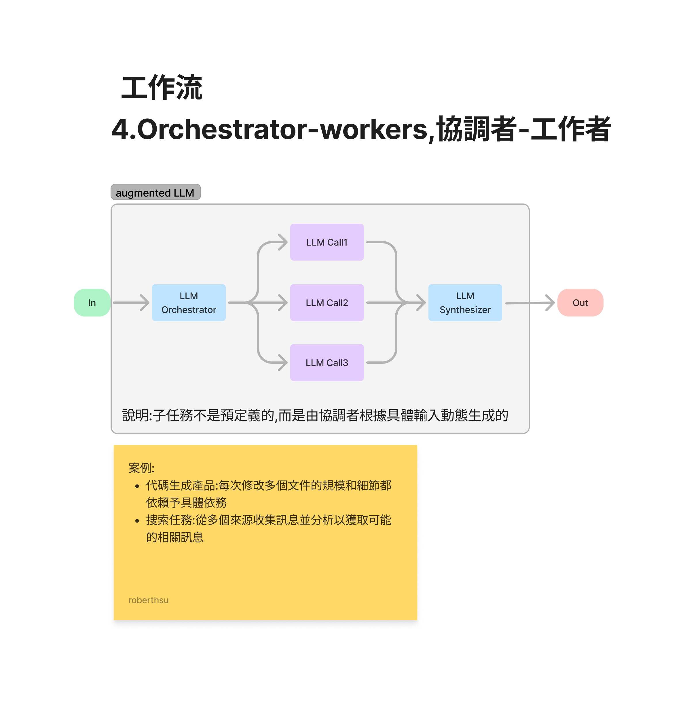
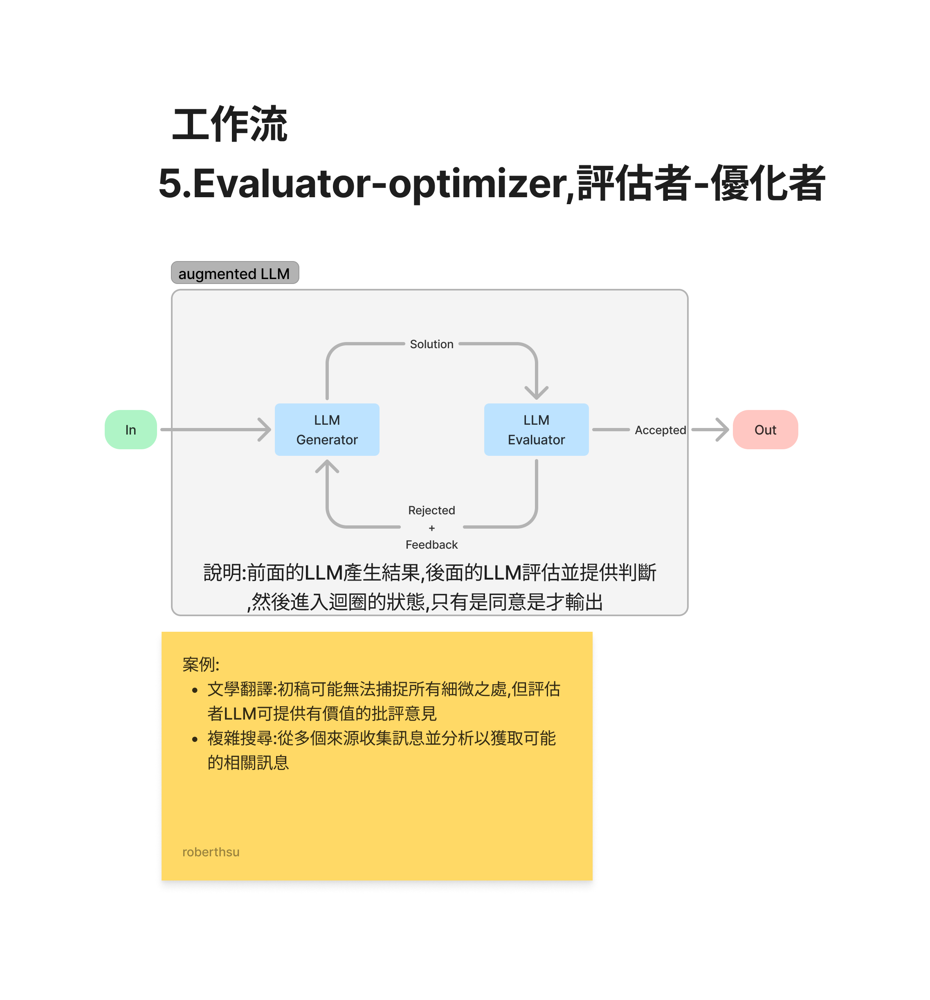
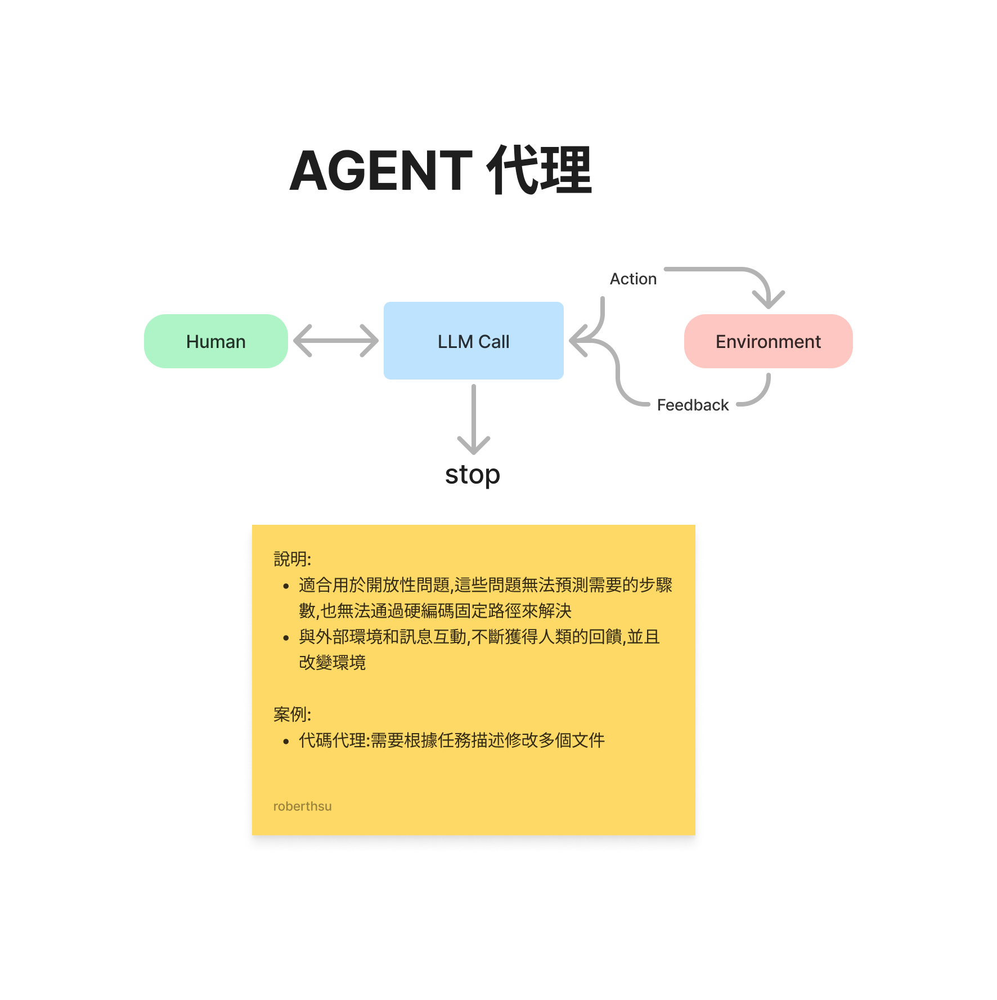

# 何謂AI代理

- 自動完整整套工作流程

## workflows工作流類別

1. Prompt chaining 串聯
2. Routing 選擇路徑
3. Parallelization 並聯
4. Orchestrator-workers 協調者-工作者
5. Evaluator-optimizer 評估者-優化者

### 基本構成元素
- 輸入
- augmented LLM(增強型大語言模型)
- 輸出

### Prompt chaining 串聯

### Routing 選擇路徑

### Parallelization 並聯

 

### Orchestator-workers,協調者-工作者

### Evaluator-optimizer,評估者-優化者

## AGENT 代理

> [參考來源影片-木子不寫代碼](https://youtu.be/YdnolQrG-xE?si=84Vp3Uot_tU36dFG)
